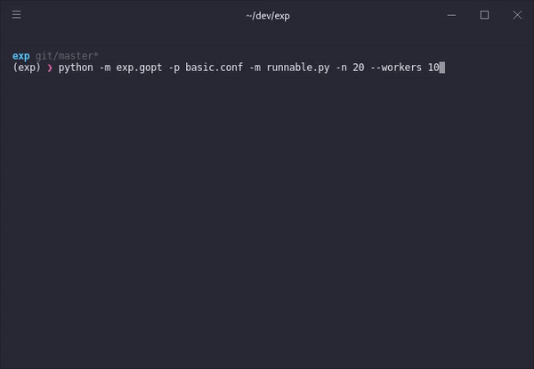
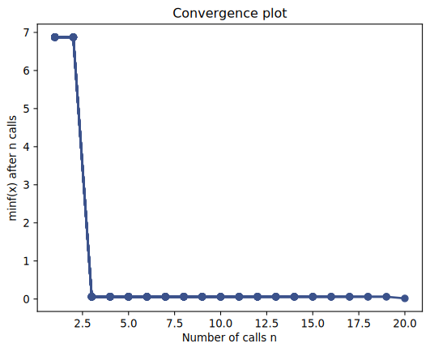

<p align="center">
  <a href="https://github.com/davidenunes/exp" target="_blank">
    
  </a>
</p>
<p align="center">Experiment <strong>design</strong>, <strong>deployment</strong>, and <strong>optimization</strong></p>

EXP is a python experiment management toolset created to simplify two simple use cases: design and deploy experiments in the form of python modules/files.

An experiment is a series of runs of a given configurable module for a specified set of parameters. This tool covers one of the most prevalent experiment deployment scenarios: testing a set of parameters in parallel in a local machine or homogeneous cluster. EXP also supports [global optimization](https://www.cs.ox.ac.uk/people/nando.defreitas/publications/BayesOptLoop.pdf) using **gaussian processes** or other surrogate models such as **random forests**. This can be used for instance as a tool for **hyperoparameter tuning** for machine learning models.

## Features
* **parameter space design** based on configuration files ([TOML](https://github.com/toml-lang/toml) format);
* **parallel experiment deployment** using ``multiprocessing`` processes;
* **CUDA gpu workers** one parallel process per available GPUs: uses the variable [CUDA_VISIBLE_DEVICES](https://devblogs.nvidia.com/cuda-pro-tip-control-gpu-visibility-cuda_visible_devices);
* **global optimization** from parameter spaces (e.g. for hyperparameter tunning) using [scikit-optimize](https://scikit-optimize.github.io/).

## Installation
work in progress

## Getting Started: Optimization

### 1. Runnable Module
The first step is to create a module to use in our experiments. A basic configurable module ``runnable.py`` looks like this:

```python
def run(x=1, **kwargs):
    return x ** 2
```

The module simply computes the square of a parameter ``x``. Note that ``kwargs`` is included in case the experiment runner dispatcher sends other parameters (that might not be used by your module). Since run receives a dictionary, you could also define it as follows.

```python
def run(**kwargs):
    x = kwargs.get('x',1)
    return x ** 2
```

### 2. Parameter Space Definition
Next, we need a configuration file ``basic.conf`` were the parameters are specified:
```markdown
[x]
type = "range"
bounds = [-10,10]
```
This defines a parameter space with a single parameter ``x`` with values in the range ``[-10,10]``. For how to specify parameter spaces, see the specification
[here](##Parameter Space Specification).

### 3. Module Optimization
Our simple module returns the ``x**2``, the optimizer tries to find the minimum value of this function based on the parameter space given by the configuration file. In this case, the optimizer will look at values of ``x`` between ``[-10,10]`` and try to find the minimum value.

```bash
python -m exp.gopt --params basic.conf --module runnable.py --n 20 --workers 4
```
<center>


<br />
</center>

finds a solution very close to ``0``. By default, the optimizer assumes a range defines the boundaries of a real-valued variable. If you wish to optimize discrete integers use the following specification:

```markdown
[x]
type = "range"
bounds = [-10,10]
dtype = "int"
``` 
The optimizer will explore discrete values between -10 and 10 inclusively. Also, using the ``--plot`` flag displays a real-time **convergence plot** for the optimization process.

<center>

<br/>
</center>

which in this case converges immediately because the function to be optimized is quite simple, but the goal is to optimize complex models and choosing from a large set of parameters without having to run an exhaustive search through all the possible parameter combinations.

## Parameter Space Specification
Parameter space files use [TOML](https://github.com/toml-lang/toml) format, I recommend taking a look at the specification and getting familiar with how to define values, arrays, etc. In any case if the file cannot be parsed, and error will be thrown. ParamSpaces in EXP has **4 types of parametes**, namely:
* **value**: single value parameter;
* **range**: a range of numbers between bounds;
* **random**: a random *real/int* value between bounds;
* **list**: a list of values (used for example to specify categorical parameters);

Bellow, I supply an example for each type of parameter:

### Value
Single value parameter.
```python
# this a single valued parameter with a boolean value
[some_param]
type = "value"
value = true
```
### Range
A parameter with a set of values within a range.
```python
# TOML files can handle comments which is useful to document experiment configurations
[some_range_param]
type = "range"
bounds = [-10,10]
step = 1 	 	# this is optional and assumed to be 1
dtype = "float"   # also optional and assumed to be float
```
The commands ``run`` and ``gopt`` will treat this parameter definition differently. The optimizer will explore values within the bounds including the end-points. The runner will take values between ``bounds[0]`` and ``bounds[1]`` excluding the last end-point (much like a python range or numpy arange).

The ``dtype`` also influences how the optimizer looks for values in the range, if set to ``"int"``, it explores discrete integer values within the bounds; if set to ``"float"``, it assumes the parameter takes a continuous value between the specified bounds.

### Random
```python
[random_param]
type="random"

```
### List


### ParamSpace
The ``exp.params.ParamSpace`` class provides a way to create parameter spaces and iterate over all the possible 
combinations of parameters as follows: 
```python
>>>from exp.params import ParamSpace
>>>ps = ParamSpace()
>>>ps.add_value("p1",1)
>>>ps.add_list("p2",[True,False])
>>>ps.add_range("p3",low=0,high=10,dtype=int)
>>>ps.size
20
```

```python
grid = ps.param_grid(runs=2)
```
``grid`` has ``2*ps.size`` configurations because we repeat each configuration ``2`` times (number of runs). Each configuration dictionary includes 2 additional parameters ``"id"`` and ``"run"`` which are the unique configuration id and run id respectively.

### Notes:
* the **"range" param type** works differently on ``gopt`` and ``run`` commands. The **optimizer** will use the bounds of the range to explore parameters within the range **including the end-points**. When specifying parameter grids, the **runner** assumes a range **does not include the end-point** (and thus works like a python or numpy range).
